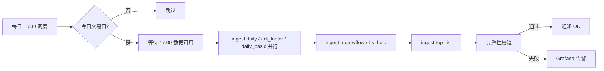

# 数据血缘与冷启动顺序（Data Lineage）

> 面向：DBA / 实施工程师 / 故障排查
> 目标：清晰描述 ~20 个核心表的依赖关系、冷启动顺序、出错定位决策树。
>
> 前置：182 个表中只有 ~20 个是被高频引用的"核心表"，其余 ~160 个是叶子节点（只被业务查询消费）。

---

## 1. 核心表依赖图

```mermaid
graph TD
    subgraph "Layer 0: 基础参考表（无依赖）"
        L0_TC[trade_cal<br/>交易日历]
        L0_NS[namechange<br/>股票曾用名]
    end

    subgraph "Layer 1: 主体注册表"
        L1_SB[stock_basic<br/>A 股列表]
        L1_HK[hk_basic<br/>港股列表]
        L1_FB[fund_basic<br/>基金列表]
        L1_CB[cb_basic<br/>转债基础]
        L1_OB[opt_basic<br/>期权合约]
        L1_FU[fut_basic<br/>期货合约]
        L1_IDX[index_basic<br/>指数列表]
    end

    subgraph "Layer 2: 主体属性 / 行业归属"
        L2_IM[industry_member<br/>申万成员]
        L2_TM[ths_member<br/>同花顺概念成员]
        L2_THSI[ths_index<br/>同花顺概念索引]
        L2_DCI[dc_index<br/>东财概念索引]
        L2_SHIBOR[shibor<br/>利率]
    end

    subgraph "Layer 3: 行情 / 估值（主流量）"
        L3_DAILY[daily<br/>日 K 线]
        L3_AF[adj_factor<br/>复权因子]
        L3_DB[daily_basic<br/>每日指标]
        L3_MIN[stk_mins<br/>分钟线]
        L3_INDEX_D[index_daily<br/>指数日线]
        L3_FUND_D[fund_daily<br/>基金日线]
        L3_OPT_D[opt_daily<br/>期权日线]
        L3_CB_D[cb_daily<br/>转债日线]
    end

    subgraph "Layer 4: 衍生 / 行为"
        L4_MF[moneyflow<br/>资金流向]
        L4_TL[top_list<br/>龙虎榜]
        L4_HK[hk_hold<br/>北向持股]
        L4_BL[block_trade<br/>大宗交易]
        L4_FA[fina_indicator<br/>财务指标]
        L4_FB[fina_balance<br/>资产负债]
        L4_FI[fina_income<br/>利润表]
        L4_FC[fina_cashflow<br/>现金流量]
        L4_DIV[dividend<br/>分红送股]
        L4_SF[share_float<br/>限售解禁]
    end

    subgraph "Layer 5: 事件 / 公告（叶子）"
        L5_EXP[express<br/>业绩快报]
        L5_FOR[forecast<br/>业绩预告]
        L5_HN[stk_holdernumber<br/>股东户数]
        L5_TH[top10_holders]
        L5_TFH[top10_floatholders]
    end

    L0_TC --> L3_DAILY
    L0_TC --> L3_INDEX_D
    L0_TC --> L4_MF
    L1_SB --> L3_DAILY
    L1_SB --> L3_DB
    L1_SB --> L3_AF
    L1_SB --> L3_MIN
    L1_SB --> L4_MF
    L1_SB --> L4_TL
    L1_SB --> L4_HK
    L1_SB --> L4_BL
    L1_SB --> L4_FA
    L1_SB --> L4_DIV
    L1_SB --> L4_SF
    L1_SB --> L5_EXP
    L1_SB --> L5_FOR
    L1_SB --> L2_IM
    L1_SB --> L2_TM
    L1_HK --> L4_HK
    L1_FB --> L3_FUND_D
    L1_CB --> L3_CB_D
    L1_OB --> L3_OPT_D
    L1_IDX --> L3_INDEX_D
    L2_THSI --> L2_TM
    L4_FA --> L4_FB
    L4_FA --> L4_FI
    L4_FA --> L4_FC

    style L0_TC fill:#e1f5ff
    style L1_SB fill:#fff4e1
    style L3_DAILY fill:#ffe1e1
    style L4_FA fill:#e1ffe4
```



---

## 2. 冷启动顺序（必须按层执行）

### Layer 0：基础参考表（无依赖）

```sql
-- 1. 交易日历（影响所有日频任务的 trade_date 枚举）
CALL ingest('trade_cal', exchange='SSE',  start='19900101', end=today());
CALL ingest('trade_cal', exchange='SZSE', start='19910101', end=today());

-- 2. 股票曾用名（影响 stock_basic 的历史名称回溯）
CALL ingest('namechange');
```

**预计耗时**：5 分钟。**失败影响**：所有后续任务都不能启动。

---

### Layer 1：主体注册表

```sql
-- 3-9. 全量小表，单次拉取
CALL ingest('stock_basic',  list_status='L,D,P');
CALL ingest('hk_basic');
CALL ingest('fund_basic');
CALL ingest('cb_basic');
CALL ingest('opt_basic');
CALL ingest('fut_basic');
CALL ingest('index_basic');
```

**预计耗时**：10 分钟。**失败影响**：Layer 3+ 所有按 ts_code 循环的任务无法生成参数。

**关键检查**：
```sql
SELECT count() FROM db_tushare.stock_basic FINAL;  -- 应 ≥ 5400
SELECT count() FROM db_tushare.stock_basic FINAL WHERE list_status = 'L';  -- 应 ≥ 5000
```

---

### Layer 2：主体属性 / 行业归属

```sql
-- 10-14
CALL ingest('industry_member',  src='SW2021', level='L1,L2,L3');
CALL ingest('ths_index');
CALL ingest('ths_member');
CALL ingest('dc_index');
CALL ingest('shibor', start='20100101', end=today());
```

**预计耗时**：30 分钟。**失败影响**：板块类查询（Q17, Q18, Q19）失效。

---

### Layer 3：行情 / 估值（主流量层，最重）

```sql
-- 15-22, 大表，按 trade_date 循环或按 ts_code 切片
CALL bootstrap_daily(start='20100101', end=today());
-- 内部：按 trade_date 调用 pro_bar，每日 5500 行 × 14 年 ≈ 18M 行
```

**预计耗时**：
- daily / daily_basic / adj_factor：每个 ~6 小时（历史 14 年）
- stk_mins（分钟线，可选）：~24 小时
- index_daily / fund_daily / opt_daily / cb_daily：合计 ~4 小时

**总计**：合并并发 12 worker 后约 18-22 小时（不含 stk_mins）。

**关键检查**：
```sql
-- daily 完整性
SELECT trade_date, count() AS cnt FROM db_tushare.daily FINAL
WHERE trade_date >= '20240101'
GROUP BY trade_date HAVING cnt < 5000  -- 异常日期
ORDER BY trade_date;

-- adj_factor 与 daily 对齐
SELECT count() FROM db_tushare.daily FINAL d
LEFT JOIN db_tushare.adj_factor FINAL a USING (ts_code, trade_date)
WHERE d.trade_date = '20250424' AND a.adj_factor IS NULL;
-- 应 = 0（停牌日 daily 也无数据）
```

---

### Layer 4：衍生 / 行为

```sql
-- 23-32
CALL bootstrap_moneyflow(start='20100101', end=today());
CALL bootstrap_top_list(start='20100101', end=today());
CALL bootstrap_hk_hold(start='20140101', end=today());  -- 互联互通从 2014 开始
CALL bootstrap_block_trade(start='20100101', end=today());
CALL bootstrap_fina_all(start='20100101', end=today());  -- balance/income/cashflow/indicator 联动
CALL bootstrap_dividend(start='20100101', end=today());
CALL bootstrap_share_float(start='20100101', end=today());
```

**预计耗时**：合计 ~12 小时（fina_indicator 是 per_symbol_period 策略，最慢 ~8h）。

**关键检查**：
```sql
-- 财务表数据完整性（最新一期）
SELECT 'balance'  AS tbl, count(DISTINCT ts_code) FROM db_tushare.fina_balance  FINAL WHERE end_date = '20241231'
UNION ALL SELECT 'income',   count(DISTINCT ts_code) FROM db_tushare.fina_income   FINAL WHERE end_date = '20241231'
UNION ALL SELECT 'cashflow', count(DISTINCT ts_code) FROM db_tushare.fina_cashflow FINAL WHERE end_date = '20241231'
UNION ALL SELECT 'indicator',count(DISTINCT ts_code) FROM db_tushare.fina_indicator FINAL WHERE end_date = '20241231';
-- 4 个值应该接近（5000±200），差距太大说明某张表 bootstrap 失败
```

---

### Layer 5：事件 / 公告（叶子）

```sql
-- 33-45+
CALL bootstrap_express(start='20100101', end=today());
CALL bootstrap_forecast(start='20100101', end=today());
CALL bootstrap_stk_holdernumber(start='20100101', end=today());
CALL bootstrap_top10_holders(start='20100101', end=today());
CALL bootstrap_top10_floatholders(start='20100101', end=today());
-- ... 其余按 a-ai-ai-tushare-pro-kind-gizmo.md 附录 A
```

**预计耗时**：~6 小时。**失败影响**：仅影响对应业务查询，不影响主流量。

---

## 3. 总冷启动时间预算

| 阶段 | 时长 | 备注 |
|------|------|------|
| Layer 0-2 | 1 小时 | 元数据，必须先完成 |
| Layer 3（行情主） | 18-22 小时 | 周末跑 |
| Layer 4（衍生） | 12 小时 | 周末跑（与 L3 并行） |
| Layer 5（叶子） | 6 小时 | 周末跑（与 L4 并行） |
| **总计** | **~36 小时** | 周五晚启动，周日完成 |

**机器约束**：12 worker × 95% × 500 RPM = 5700 calls/min，单接口积分上限 ≤ 500/min，所以并发瓶颈在 worker 数与接口配额，不在网络。

---

## 4. 故障定位决策树

```
查询返回空 / 错误
├── 查询结果为空
│   ├── trade_date 未来日期？ → 提示用户
│   ├── stock_basic 中 ts_code 存在？
│   │   ├── 否 → 拼写错误 / 已退市
│   │   └── 是 → 检查 sync_state
│   └── sync_state['daily'].last_success < 昨天？
│       ├── 是 → 调度器异常 → 看 logs
│       └── 否 → 数据真无（停牌等）
│
├── 查询超时
│   ├── 加了 trade_date 范围？
│   │   └── 否 → 全表扫，加范围
│   ├── EXPLAIN PIPELINE 看 part 数 > 100？
│   │   └── 是 → OPTIMIZE TABLE ... FINAL
│   └── 内存使用 > max_memory_usage？
│       └── 是 → 加 max_bytes_before_external_group_by
│
├── 查询结果有重复行
│   ├── 没加 FINAL → ReplacingMergeTree 必须 FINAL
│   └── JOIN 时 USING 列不唯一 → 检查关联键
│
├── 财务因子滞后
│   ├── 季报披露窗口 4-30 / 8-30 / 10-30 → 正常
│   └── 用 argMax(end_date) 取最新
│
└── 行业 / 概念查询返回空
    ├── industry_member 表为空 → Layer 2 没跑
    └── stock_basic.industry 为空 → 历史数据缺字段，用 industry_member 替代
```

---

## 5. 表级故障的横向影响

| 故障表 | 直接影响业务 | 间接影响 | 修复优先级 |
|--------|------------|----------|------------|
| `trade_cal` | 所有日频调度无法选 trade_date | 全部 | **P0** |
| `stock_basic` | 全量股票循环失败 | 全部 | **P0** |
| `daily` | K 线、技术指标、回测 | 90% 查询 | **P0** |
| `adj_factor` | 复权计算 | K 线连续性 | **P0** |
| `daily_basic` | PE/PB、市值、换手率 | 多因子 | **P1** |
| `fina_indicator` | 多因子打分、ROE 排名 | 基本面分析 | **P1** |
| `moneyflow` | 资金流分析 | 资金类查询 | **P2** |
| `industry_member` | 行业归属、板块排名 | 板块查询 | **P2** |
| `top_list` | 龙虎榜 | 龙虎榜查询 | **P3** |
| `dividend` | 股息率 | 股息查询 | **P3** |

修复优先级：**P0 必须 1 小时内修复**，**P1 当日修复**，**P2 当周**，**P3 当月**。

---

## 6. 增量任务依赖



**依赖说明**：
- 财务表（fina_*）周二/周四单独调度，不在每日链路
- 周末调度做 7 天回补（防补丁数据）

---

## 7. 表新增 / 删除流程

新增表：
1. 在 `config/interfaces.yaml` 增条目（含 strategy + scope_key + frequency）
2. 在 `samples/<api_name>.json` 放采样
3. 跑 `tushare-db bootstrap --only <api_name>`
4. 验证 `system.tables WHERE database = 'db_tushare' AND name = '<api_name>'`
5. 加 `CODEMAP` 与本文件 Layer 归位

删除表：
1. `DROP TABLE IF EXISTS db_tushare.<api_name>`
2. 删除 `sync_state` 中对应行
3. 删除 `config/interfaces.yaml` 与 `samples/`
4. 检查上游：本表是否被其他表引用？被引用则需先解耦

---

## 8. AI 自助查询参考

AI 通过 `schema_describe` + `data_freshness` 工具查询本图谱：

```python
# AI 决策示例
freshness = call_tool("data_freshness", {"tables": ["daily", "adj_factor"]})
if freshness["tables"][0]["last_trade_date"] < today_str:
    ask_user("daily 数据未更新到今日，是否使用昨日数据？")
```

---

> 维护：每次 Layer 跨层依赖变化时更新 Mermaid + 优先级表。
